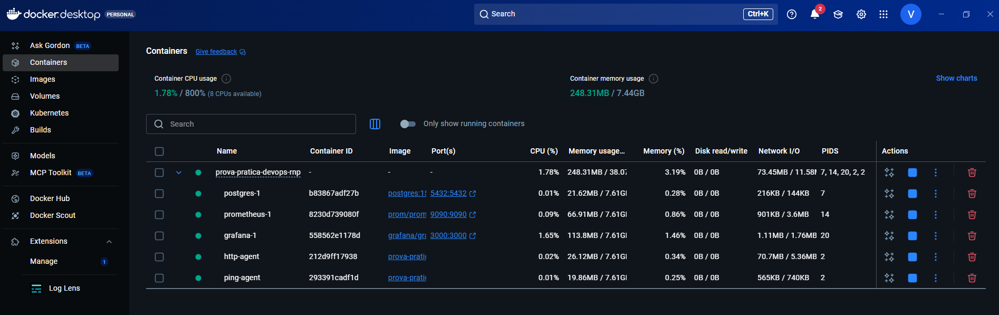
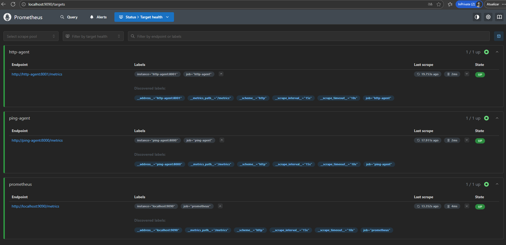
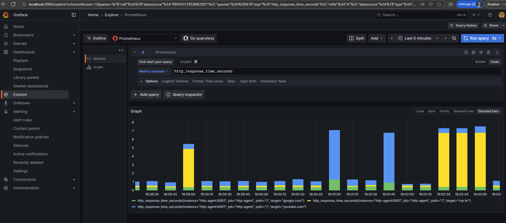
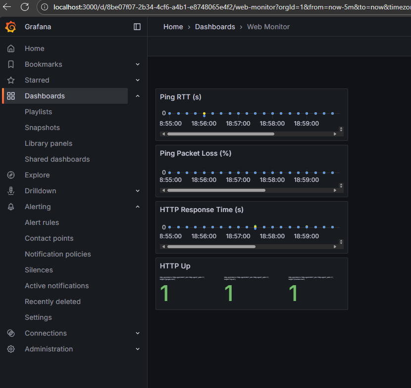
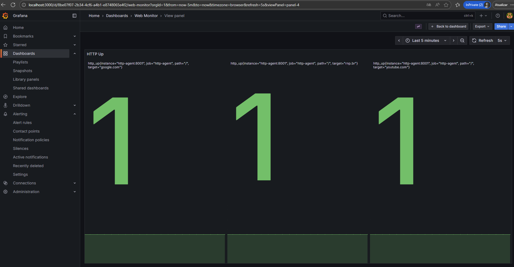
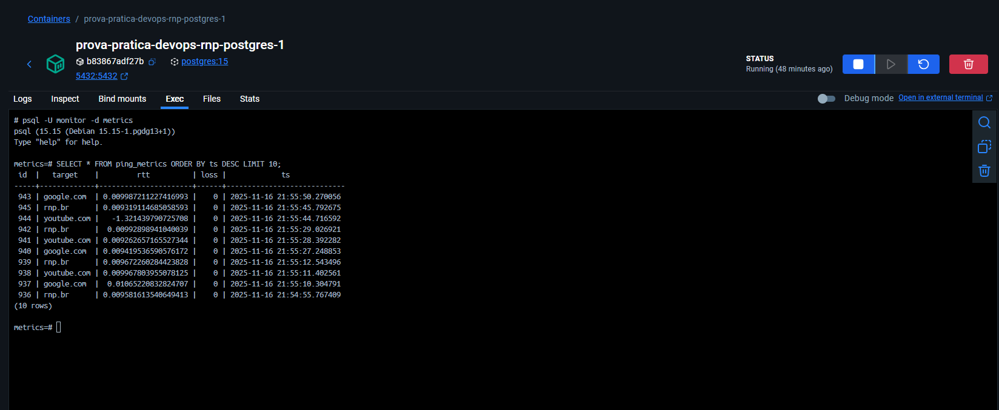

# High Level Design — Agente de Monitoramento Web

## Objetivo
Monitorar disponibilidade e performance (ping e HTTP) de alguns domínios e permitir visualização via Grafana.

## Componentes
- ping-agent: coleta RTT e perda via ICMP
- http-agent: coleta tempos HTTP e códigos
- Prometheus: coleta/salva métricas (TSDB)
- Grafana: dashboards

## Fluxo de dados
1. Agents realizam checagens a cada 15s.
2. Cada agent expõe métricas Prometheus no /metrics.
3. Prometheus faz scrape destes endpoints e grava em seu TSDB.
4. Grafana consulta Prometheus

## Containers

## Prometheus

## Grafana

## Banco de Dados

### Demonstração de conexão e consulta ao banco no container

